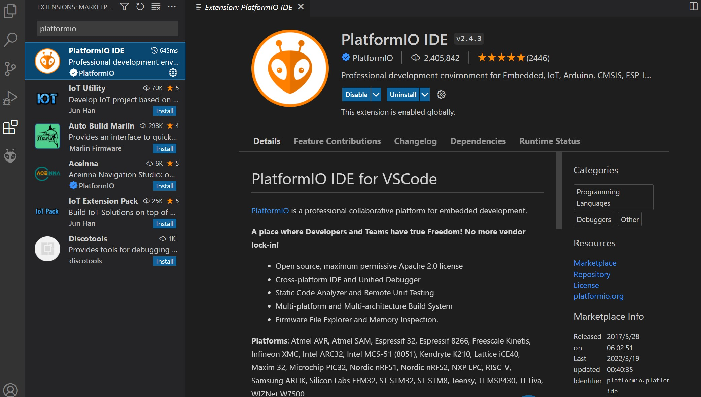
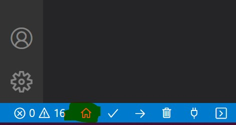
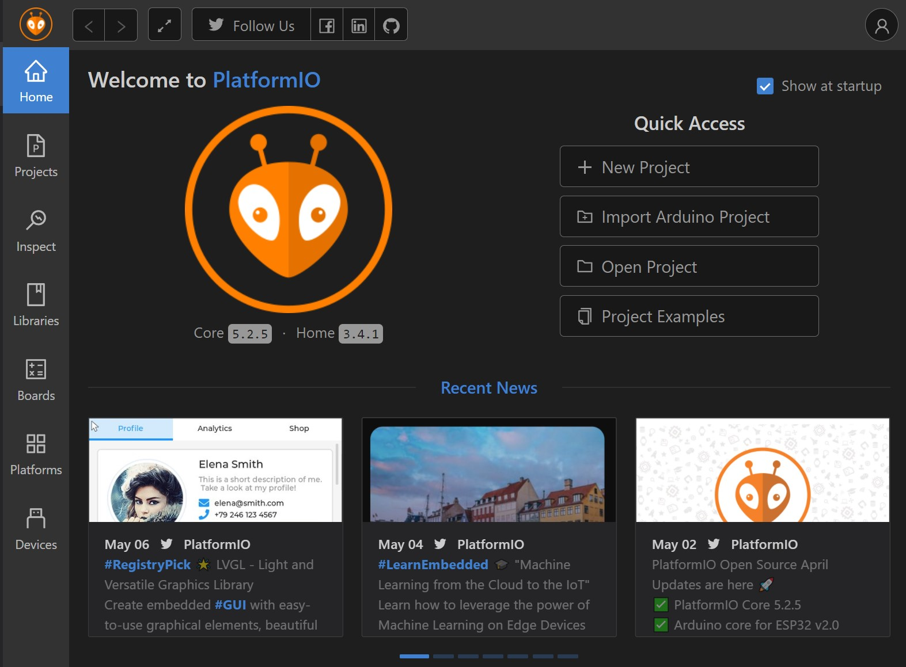
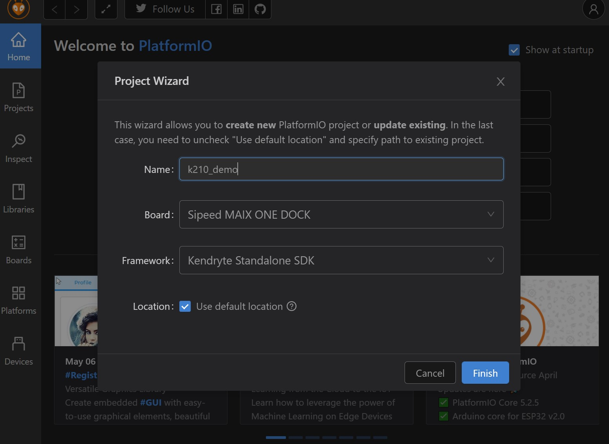
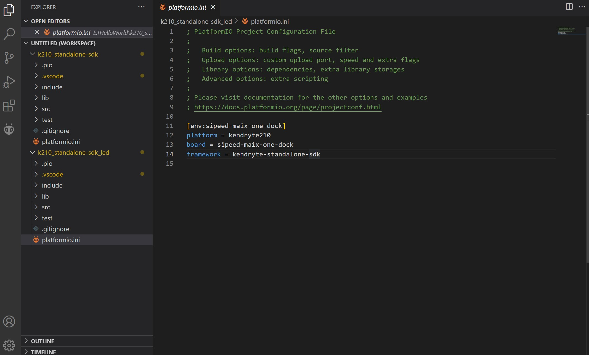
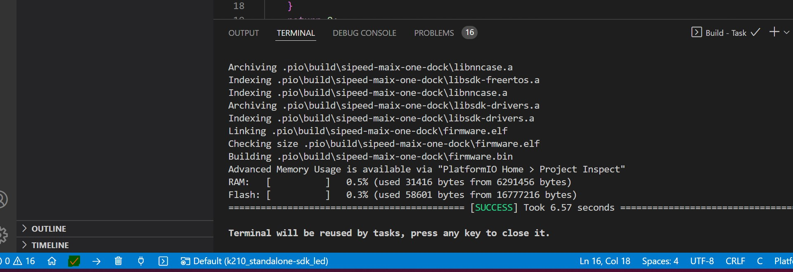
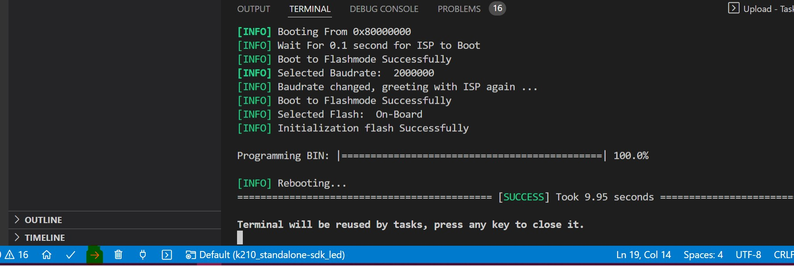

# k210_standalone-sdk_demo

## 在VSCode中使用PlatformIO插件进行k210的裸机开发

### 开发环境配置

- 安装VSCode。

- 在`Extensions`中搜索`PlatformIO`并安装。

  

- 安装成功后可以在VSCode的左下角看到一个小房子的标识。

  

- 点击这个小房子可以看到platformio的主页，点击`New Project`创建新项目。

  

- `Name`为项目名称；`Board`为使用的开发板，这里我使用的是Sipeed的MaixDock开发板；`Framework`为开发框架，由于本项目使用裸机开发，选择Kendryte Standalone SDK，还有其他的开发框架可供选择；`Location`为项目位置。

  

- 完成设置后点击`Finish`。首次创建新Board或新Framework时，等待过程会比较漫长，这个过程中可以去做其他事情了。

- 创建成功后的界面如下所示。

  

- 在src文件夹下创建`main.c`程序，实现点灯。

  ```
  #include <stdio.h>
  #include <unistd.h>
  #include "fpioa.h"
  #include "gpio.h"
  
  int main(void)
  {
      fpioa_set_function(24, FUNC_GPIO3);
  
      gpio_init();
      gpio_set_drive_mode(3, GPIO_DM_OUTPUT);
      gpio_pin_value_t value = GPIO_PV_HIGH;
      gpio_set_pin(3, value);
      while (1)
      {
          sleep(1);
          gpio_set_pin(3, value = !value);
      }
      return 0;
  }
  ```

- 点击左下角的`√`进行编译。

  

- 编译通过后再点击坐下角的`->`下载至开发板上。

  

- 下载成功后，即可看到开发板上的led开始闪烁。